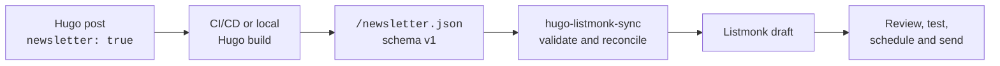

# hugo-listmonk-sync

`hugo-listmonk-sync` turns selected Hugo posts into Listmonk draft campaigns.
It polls a versioned JSON feed, validates the complete response, and creates or
refreshes matching drafts without changing campaigns that have left draft
status.

The service is deliberately limited:

- It creates missing campaigns as drafts.
- It updates synchronizer-owned campaign content only when a draft is stale.
- It generates structured plain-text bodies alongside the HTML body.
- It never sends, schedules, archives, deletes, or recreates campaigns.
- It leaves sent and otherwise non-draft campaigns unchanged.

[Listmonk 6.0 or newer](https://github.com/knadh/listmonk/releases/tag/v6.0.0)
is required because the synchronizer stores Hugo metadata in campaign-level
`attribs`.

## How it works



Hugo feed generation and draft reconciliation can be automated. Campaign
review and sending remain explicit Listmonk actions.

This repository includes both sides of the integration:

- [`examples/hugo-newsletter`](examples/hugo-newsletter/) is a self-contained
  Hugo feed implementation.
- [`blog-updates.gohtml`](blog-updates.gohtml) is a configurable Listmonk email
  template.
- `src/hugo_listmonk_sync` contains the polling and reconciliation service.

## Quick start

You need:

- Docker with Docker Compose
- a reachable Listmonk 6.0+ instance
- a published Hugo JSON feed that follows the [feed contract](#feed-contract)
- a dedicated Listmonk API user with the
  [required permissions](#listmonk-setup)

Clone the repository and create a local environment file:

```sh
git clone https://github.com/mitcdh/hugo-listmonk-sync.git
cd hugo-listmonk-sync
cp .env.example .env
```

Edit `.env` and replace the example URLs, token, and list ID:

```dotenv
NEWSLETTER_JSON_URL=https://blog.example.com/newsletter.json
LISTMONK_BASE_URL=https://listmonk.example.com
LISTMONK_API_USERNAME=hugo-newsletter-sync
LISTMONK_API_TOKEN=replace-with-api-token
LISTMONK_LIST_IDS=1
```

`LISTMONK_LIST_IDS` uses Listmonk's positive numeric API IDs, not the public
UUIDs used by subscription forms.

Build and start the service:

```sh
docker compose up --build -d
docker compose logs -f hugo-listmonk-sync
```

The first reconciliation runs immediately. By default, another cycle starts
one hour after the previous cycle finishes. Open Listmonk and confirm that each
unmatched feed entry appears as a draft campaign.

Stop the service with:

```sh
docker compose down
```

## Hugo feed setup

The included [`examples/hugo-newsletter`](examples/hugo-newsletter/) directory
is a runnable reference implementation. Copy its newsletter layout and
partials into your Hugo site, then merge the relevant settings from its
[`hugo.toml`](examples/hugo-newsletter/hugo.toml).

### Select posts

The example feed includes pages in the `posts` section whose front matter sets
`newsletter: true`:

```yaml
---
title: "Post title"
date: 2025-01-01T12:00:00+10:00
lastmod: 2025-01-02T09:30:00+10:00
description: "A concise description used in the newsletter."
image: "/images/my-post.webp"
newsletter: true
tags: [Writing, Technology]
---
```

The final path component of `.RelPermalink` becomes the default campaign key.
For example, a post published at `/posts/my-post/` produces the key
`my-post`.

### Configure the output

Add a custom output format to your Hugo configuration:

```toml
baseURL = "https://blog.example.com/"

[outputFormats.Newsletter]
  mediaType = "application/json"
  baseName = "newsletter"
  isPlainText = true
  notAlternative = true

[outputs]
  home = ["HTML", "RSS", "JSON", "Newsletter"]
```

The `Newsletter` output renders
[`layouts/home.newsletter.json`](examples/hugo-newsletter/layouts/home.newsletter.json)
to `public/newsletter.json`. `baseURL` must be the site's canonical public URL
so relative links and assets can be resolved for email clients.

Use the layout with all four supporting partials:

- [`absolute-urls.html`](examples/hugo-newsletter/layouts/partials/newsletter/absolute-urls.html)
  finds `href`, `src`, `srcset`, and `poster` attributes in rendered HTML.
- [`absolute-url.html`](examples/hugo-newsletter/layouts/partials/newsletter/absolute-url.html)
  resolves site-relative, page-relative, and page-resource URLs.
- [`absolute-srcset.html`](examples/hugo-newsletter/layouts/partials/newsletter/absolute-srcset.html)
  resolves each candidate without losing its width or density descriptor.
- [`escape-code-delimiters.html`](examples/hugo-newsletter/layouts/partials/newsletter/escape-code-delimiters.html)
  protects `{{` and `}}` inside displayed code from Listmonk's Go template
  renderer.

Rendered URLs inside the `html` field become absolute. The top-level `image`
field deliberately retains the front matter value so campaign templates can
handle it as metadata.

The example enables Goldmark's `unsafe` renderer only because its fixture
contains trusted raw HTML. A site that does not intentionally allow raw HTML in
Markdown does not need that setting.

### Build and verify

Build the standalone example from the repository root:

```sh
hugo --source examples/hugo-newsletter --gc --minify
jq -e '.schemaVersion == 1 and (.posts | type == "array")' \
  examples/hugo-newsletter/public/newsletter.json
jq '.posts[] | {key, title, date, lastmod, url}' \
  examples/hugo-newsletter/public/newsletter.json
```

After deploying your Hugo site, verify the public feed:

```sh
curl --fail --silent --show-error https://blog.example.com/newsletter.json \
  | jq '.posts[] | {key, title, date, lastmod, url}'
```

## Feed contract

The response must be a JSON object containing `schemaVersion: 1` and a `posts`
array:

```json
{
  "schemaVersion": 1,
  "posts": [
    {
      "key": "my-post",
      "url": "https://blog.example.com/posts/my-post/",
      "title": "My post",
      "description": "A concise post description.",
      "date": "2025-01-01T12:00:00+10:00",
      "lastmod": "2025-01-02T09:30:00+10:00",
      "readingTime": 8,
      "image": "/images/my-post.webp",
      "tags": ["Writing", "Technology"],
      "html": "<p>Newsletter body</p>",
      "text": "Newsletter body"
    }
  ]
}
```

By default, each post must have non-empty string values for:

- `key`, used as the Listmonk campaign name and synchronization key
- `title`, used as the campaign subject
- `html`, used as the campaign body

The `CAMPAIGN_*_FIELD` settings can select different top-level keys. Selectors
are literal keys, not JSONPath expressions. Every selected campaign name must
be unique within a cycle.

The synchronizer copies every top-level post field except `html` and `text`
into `.Campaign.Attribs.post`. Arbitrary additional metadata is preserved. A
numeric `readingTime` becomes `"<N> min read"`; an existing string is retained.

`date` is the publication date and is used only for presentation. `lastmod` is
the reconciliation version: when present, it must be a timezone-aware ISO 8601
string. The synchronizer compares timestamp instants, not their string forms,
and stores the original feed string unchanged. A feed without `lastmod` remains
valid schema v1 and uses the previous always-update behavior.

The selected content field is the source for the campaign body. For HTML and
rich-text campaigns, the synchronizer derives an e-mail-safe HTML fragment
from it. The `html` field is also the source for the generated alternate body.
The `text` field is retained only as a fallback when HTML conversion is
unavailable or fails; neither large body is copied into campaign attributes.

The complete feed is validated before any Listmonk mutation. Invalid JSON, an
unsupported schema version, a missing selected field, duplicate campaign
names, or a present but malformed or timezone-naive `lastmod` reject the entire
cycle.

## Reconciliation and safety

Campaign names are matched exactly and case-sensitively:

| Matching campaigns | Action |
| --- | --- |
| None | Create a new draft. |
| One draft | Apply the last-modified rules below. |
| One non-draft | Leave it unchanged. |
| Two or more | Treat the name as ambiguous and change none of them. |

For one matching draft, reconciliation uses these ordered rules:

| Feed and campaign state | Action |
| --- | --- |
| Feed has no `lastmod` | Update using schema-v1 compatibility behavior. |
| Campaign has no `attribs.post.lastmod` | Update and backfill it. |
| Campaign's stored `lastmod` is malformed | Warn, update conservatively, and replace it. |
| Feed instant is newer | Update. |
| Instants are equal but generated content differs | Update and repair the generated fields. |
| Instants are equal and generated content matches | Skip and count as `up_to_date`. |
| Feed instant is older | Warn, skip, and count as `stale_feed_skipped`; never roll back. |

`date` never participates in this comparison. Existing campaigns normally
have `date` but no `lastmod`, so the first cycle after upgrading updates each
matching draft once to backfill the timestamp and generated alternate body.

Draft updates replace only synchronizer-owned fields:

- campaign name
- subject
- HTML body
- alternate body (`altbody`)
- `attribs.post`
- `attribs.newsletter`

Existing lists, sender, template, tags, messenger, campaign and content types,
body source, headers, scheduled time, and unrelated campaign attributes are
retained. Creation-only defaults never overwrite an existing draft. Campaigns
absent from the feed are left alone. Manual edits to owned fields are replaced
when reconciliation authorizes an update.

The service never calls Listmonk's send, status, archive, or delete endpoints.
It also rechecks a campaign's status immediately before updating it, avoiding
an update if the campaign left draft status during reconciliation.

### One-shot timestamp override

Generated-field differences already cause an update when feed and campaign
timestamps are equal. For an exceptional repair where timestamp comparison
must be bypassed, run one cycle with both `RUN_ONCE=true` and
`IGNORE_LASTMOD=true`. The override changes only the decision for one exact
matching draft: non-drafts, ambiguous matches, and campaigns that leave draft
status during reconciliation remain unchanged. Feed validation also remains
active, including rejection of a malformed `lastmod`.

The override can replace a draft whose stored timestamp is newer than the
feed, including replacing its stored `attribs.post.lastmod` with the original
feed value. It should therefore be used deliberately and never configured on
the continuous service. For a standalone container using an environment file:

```sh
docker run --rm --env-file .env \
  --env RUN_ONCE=true \
  --env IGNORE_LASTMOD=true \
  ghcr.io/mitcdh/hugo-listmonk-sync:latest
```

After the feed passes validation, posts are reconciled independently. A
Listmonk error for one post is logged without preventing the remaining posts
from being processed, and each cycle ends with an outcome summary.

## Generated plain text

Every created or updated campaign receives a generated `altbody`. It mirrors
the logical order of `blog-updates.gohtml`: kicker, title, description,
publisher/date/reading time, article, canonical post link, publisher details,
and recipient links. Visual-only cover decoration, buttons, preheader padding,
and tracking pixels are not reproduced.

This is generated directly by the synchronizer; it does not depend on
Listmonk's manual UI generator or a send-time conversion step.

The plain-text converter preserves headings, paragraphs, lists, blockquotes,
and readable code blocks. Links use `label: URL`; links already displayed as a
URL are emitted once. Meaningful images use `Image: alt text — URL`, while
images without alt text are treated as decorative. Relative article links and
image destinations are resolved against the canonical post URL. Embedded
video frames become labelled destination links instead of disappearing.

Tables are rendered as padded pipe tables whose columns match their widest
cell. If any aligned table line would exceed 80 characters, the table is
replaced with a note directing the reader to the full article. This avoids
unreadable wrapping in narrow plain-text mail views.

Plain-text emphasis is emitted without Markdown `*` or `**` markers. This
keeps captions such as table titles readable in clients and previews that do
not interpret Markdown.

Web-only code controls, code-line anchors, hidden status text, footnote return
links, and redundant footnote separators are omitted. Footnote references keep
their labels, such as `[5]`, while the references remain an ordered list with
their external source links. Internal fragment destinations such as `#fn:5`
are not emitted because a plain-text MIME part has no corresponding anchors.

If HTML conversion fails, the feed's `text` field is used. A post with neither
a usable conversion nor fallback fails without being mutated.

The renderer keeps Listmonk's deliberate `{{ UnsubscribeURL }}` and
`{{ MessageURL }}` expressions. Double braces originating in article text,
displayed code, feed metadata, or configuration are emitted through safe
literal template actions so they cannot become Listmonk expressions.

Presentation values resolve in this order: a non-empty per-post feed value,
then the matching environment default, then omission. The feed keys are
`headerKicker`, `author`, `address`, `siteName`, and `baseURL`. Resolved values
are stored in synchronizer-owned `.Campaign.Attribs.newsletter` for the bundled
HTML template to consume as well.

## E-mail-safe HTML body

HTML and rich-text campaign bodies retain article headings, links, images,
lists, tables, footnotes, and code. Before a body is sent to Listmonk, relative
links and image sources are made absolute using the canonical post URL.

Article tables receive inline, content-sized layout with padded, top-aligned
cells so they remain compact in Listmonk previews and mail clients. The bundled
HTML template applies the same table layout.

Browser-only code controls, hidden status regions, scripts, and article-local
styles are removed. `<details>` sections are expanded into ordinary visible
content, and `<iframe>` embeds become labelled links because interactive
frames are not reliably supported by mail clients. Internal footnote fragment
links remain in HTML for clients and Listmonk browser views that support them.
Literal `{{` and `}}` decoded from article HTML are emitted through safe Go
template actions, preventing displayed template examples from being compiled
as Listmonk expressions.

## Listmonk setup

Create a dedicated API user under **Admin → Users**. The service authenticates
with that user's username and generated token using HTTP Basic authentication.
See Listmonk's [API authentication](https://listmonk.app/docs/apis/apis/) and
[roles and permissions](https://listmonk.app/docs/roles-and-permissions/)
documentation.

Assign:

- `campaigns:get` and `campaigns:manage`, with a list role that covers every
  configured list and every list already attached to drafts the service may
  update; or
- the corresponding `campaigns:get_all` and `campaigns:manage_all`
  permissions.

Listmonk 6.1 separates `campaigns:send` from campaign management. This service
does not require or use that permission.

`LISTMONK_BASE_URL` must be the Listmonk origin, such as
`https://listmonk.example.com`. Do not include `/api` or another path.

## Configuration

Configuration is exclusively through environment variables. `.env.example`
contains every setting used by the example Compose service. Copy it to the
git-ignored `.env` file and never commit real credentials.

| Variable | Required | Default | Meaning |
| --- | --- | --- | --- |
| `NEWSLETTER_JSON_URL` | yes | — | Absolute HTTP(S) URL of the Hugo JSON feed. |
| `LISTMONK_BASE_URL` | yes | — | Listmonk origin without a path or `/api`. |
| `LISTMONK_API_USERNAME` | yes | — | Dedicated Listmonk API username. |
| `LISTMONK_API_TOKEN` | yes | — | API user's secret token. |
| `LISTMONK_LIST_IDS` | yes | — | Comma-separated, unique positive list IDs for new campaigns. |
| `CAMPAIGN_NAME_FIELD` | no | `key` | Post key used as campaign name and synchronization key. |
| `CAMPAIGN_SUBJECT_FIELD` | no | `title` | Post key used as campaign subject. |
| `CAMPAIGN_CONTENT_FIELD` | no | `html` | Post key used as campaign body. |
| `LISTMONK_CONTENT_TYPE` | no | `html` | New campaign content type: `richtext`, `html`, `markdown`, `plain`, or `visual`. |
| `LISTMONK_CAMPAIGN_TYPE` | no | `regular` | New campaign type: `regular` or `optin`. |
| `LISTMONK_MESSENGER` | no | `email` | New campaign messenger or configured custom messenger name. |
| `LISTMONK_TEMPLATE_ID` | no | unset | Positive template ID for new campaigns; omitted when unset. |
| `LISTMONK_FROM_EMAIL` | no | unset | Sender for new campaigns; omitted so Listmonk can use its default. |
| `LISTMONK_CAMPAIGN_TAGS` | no | unset | Comma-separated tags applied only when creating campaigns. |
| `NEWSLETTER_HEADER_KICKER` | no | `NEW BLOG POST` | Plain-text and bundled HTML header kicker. |
| `NEWSLETTER_AUTHOR` | no | unset | Default publisher/author; omitted when neither config nor feed supplies it. |
| `NEWSLETTER_ADDRESS` | no | unset | Default postal address; omitted when neither config nor feed supplies it. |
| `NEWSLETTER_SITE_NAME` | no | unset | Default site name used in the plain-text site link and bundled HTML template. |
| `NEWSLETTER_BASE_URL` | no | unset | Absolute HTTP(S) default site URL used in plain text and the bundled HTML template. |
| `POLL_INTERVAL_SECONDS` | no | `3600` | Wait after each completed cycle, in seconds. |
| `HTTP_TIMEOUT_SECONDS` | no | `30` | Positive request timeout; decimals are accepted. |
| `HTTP_MAX_RETRIES` | no | `3` | Retry count after the initial safe request. |
| `LOG_LEVEL` | no | `INFO` | `DEBUG`, `INFO`, `WARNING`, `ERROR`, or `CRITICAL`. |
| `RUN_ONCE` | no | `false` | Run one immediate cycle and exit. |
| `IGNORE_LASTMOD` | no | `false` | Force owned-field updates for exact matching drafts; requires `RUN_ONCE=true`. |

Continuous mode waits only after a cycle completes, so slow cycles never
overlap. `RUN_ONCE=true` runs one cycle and exits, which is useful when an
external scheduler owns the cadence. `IGNORE_LASTMOD=true` is rejected unless
one-shot mode is also enabled, preventing a persistent service from silently
disabling timestamp reconciliation.

Feed GETs and Listmonk GET/PUTs retry HTTP 429 responses, transient 5xx
responses, and network failures with bounded exponential backoff and
`Retry-After` support. Campaign POSTs are attempted once because Listmonk does
not document an idempotency key. If a POST result is uncertain, the next cycle
discovers a successfully created campaign by name. A cycle-level failure is
logged and retried at the next configured interval.

TLS certificate verification is always enabled. For a private certificate
authority, mount its CA bundle into the container and set the standard
`SSL_CERT_FILE` or `SSL_CERT_DIR` environment variable to the in-container
path. There is no insecure TLS option.

## Campaign template

Listmonk templates can read post metadata through `.Campaign.Attribs.post` and
resolved shared presentation values through `.Campaign.Attribs.newsletter`:

```go-html-template
{{ $assetBaseURL := "https://blog.example.com" }}
{{ with .Campaign.Attribs.newsletter }}
  <p>{{ .headerKicker }} · {{ .siteName }}</p>
{{ end }}
{{ with .Campaign.Attribs.post }}
  <h1>{{ .title }}</h1>
  <p>{{ .description }}</p>
  <p>{{ .date }} · {{ .readingTime }}</p>
  {{ if .image }}{{ end }}
  <a href="{{ .url }}">Read on the web</a>
{{ end }}
```

Rendered images in the campaign body are already absolute. The base URL prefix
above supports a relative top-level `image` value.

[`blog-updates.gohtml`](blog-updates.gohtml) is a complete responsive example.
Its opening `TEMPLATE SETTINGS` block separates:

- site and publisher identity
- site, asset, logo, and fallback post URLs
- optional button visibility and email copy
- date formats and font stacks
- layout dimensions and colour palettes

For synchronized campaigns, `baseURL`, `siteName`, `publisherName`,
`postalAddress`, and `headerKicker` prefer `.Campaign.Attribs.newsletter`.
Values in the opening settings block remain fallbacks for older or manually
created campaigns. Logo and asset settings remain template-local; set
`assetBaseURL` separately when assets are served from a CDN.
`showReadPostButton` controls the optional button beneath the campaign body.

Post links prefer the canonical `.Campaign.Attribs.post.url` value and fall
back to `baseURL`, `postPath`, and the campaign name only when that metadata is
absent.

## Container image

CI publishes AMD64 and ARM64 images to:

```text
ghcr.io/mitcdh/hugo-listmonk-sync
```

Run the latest image without building locally:

```sh
docker pull ghcr.io/mitcdh/hugo-listmonk-sync:latest
docker run --rm --env-file .env ghcr.io/mitcdh/hugo-listmonk-sync:latest
```

Successful pushes to the default branch publish `latest`, the branch name, and
a `sha-...` tag. A semantic version tag such as `v1.2.3` publishes `v1.2.3`,
`1.2.3`, `1.2`, and `1`. Pull requests and other branches are build-only.

The image contains no credentials or persistent application state, uses
`python:3.13-slim`, and runs as UID/GID 10001. SIGTERM and SIGINT interrupt the
polling wait for a clean shutdown.

## Development

The project requires Python 3.13 and uses
[`uv`](https://docs.astral.sh/uv/) with a checked-in lockfile:

```sh
uv sync --frozen --all-groups
uv run ruff check .
uv run ruff format --check .
uv run mypy
uv run pytest --cov --cov-report=term-missing
```

With the required environment variables already exported, run:

```sh
uv run hugo-listmonk-sync
uv run python -m hugo_listmonk_sync
```

Build and smoke-test the container against local mock services:

```sh
docker build -t hugo-listmonk-sync:smoke .
./scripts/container-smoke.sh hugo-listmonk-sync:smoke
```

The GitHub Actions workflow runs Ruff, formatting, strict mypy checks, and the
pytest suite before building the multi-platform image.

### Module layout

- [`config.py`](src/hugo_listmonk_sync/config.py) parses and validates
  environment-only configuration.
- [`feed.py`](src/hugo_listmonk_sync/feed.py) retrieves and validates schema v1
  feeds.
- [`plaintext.py`](src/hugo_listmonk_sync/plaintext.py) resolves shared
  presentation values and generates structured alternate bodies.
- [`timestamps.py`](src/hugo_listmonk_sync/timestamps.py) parses timezone-aware
  ISO 8601 reconciliation timestamps.
- [`listmonk.py`](src/hugo_listmonk_sync/listmonk.py) implements authenticated
  campaign API operations.
- [`reconcile.py`](src/hugo_listmonk_sync/reconcile.py) applies matching and
  mutation rules.
- [`loop.py`](src/hugo_listmonk_sync/loop.py) handles immediate startup,
  post-run waits, and shutdown.
- [`main.py`](src/hugo_listmonk_sync/main.py) wires the clients and console
  entry point together.
